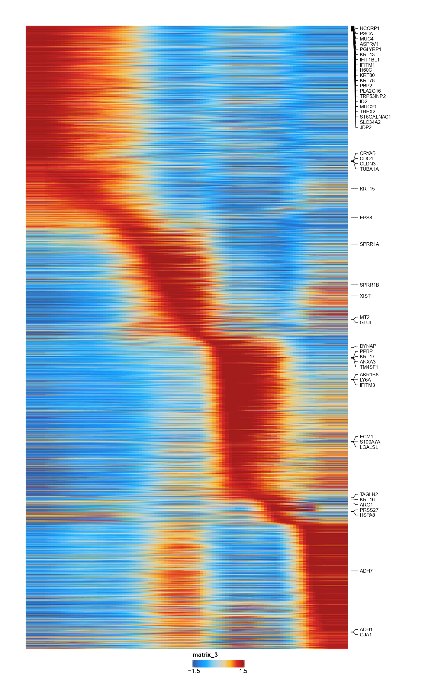
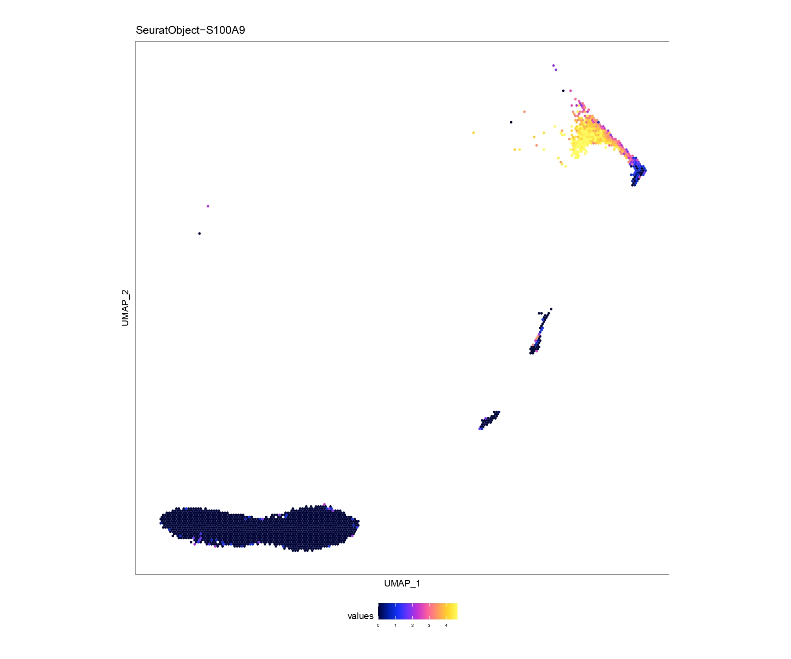
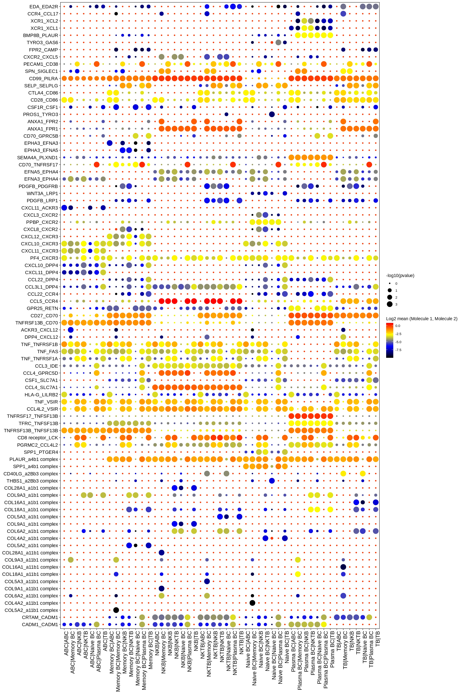
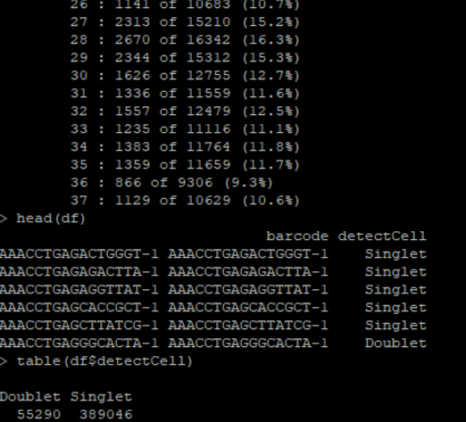

# yipCat
### Description
YipCat package can realize some of the more commonly used analysis requirements of transcription, such as 
**trajectory analysis,heatmap, cell interaction,imputeweight,cellphonedb,agescore etc** , you can view the function description inside the package.
Mainly the implementation style of the diagram is more advanced to look at, in particular, the **mass spectrometry streaming data** is also integrated and 
can achieve the interaction of **cellranger cloupe files**, very convenient.

### Installtation
you can install this package via command:
```r
install.packages("yipCat_1.0.1.tar.gz")
```

### requirement
```r
require(Seurat)
require(dplyr)
require(ggplot2)
require(S4Vectors)
require(nabor)
...
```

### trajectory 
#### The implementation of spline trajectory, the specific method description mainly draws on part of the ArchR method, the diagram is as follows：
you can caculate trajecory by follwing commands,for example
```r
seurat<-addSeuratTrajectory(object=seurat,trajectory=c("memory B","Naive B","Plasma"),groupBy="label_fine",embedding="pca") # caculate trajecory
se<-getSeuratTrajectory(seurat)  # get trajectory object
ArchR::plotTrajectoryHeatmap(se)  # plot trajectory heatmap
```


### cacaulte ImputeWeight
#### computes imputations weights that describe each cell as a linear combination of many cells based on a MAGIC diffusion matrix.
for example 
```r
seurat<-ImputeWeights(seurat,reducedDims="pca",nRep=2,sampleCells=5000)  # caculate impute weight
weight<-getImputeWeight(seurat)  # return impute weight
EmbPlot(seurat,colorBy="matrix",features="S100A9",embedding="umap",imputeWeights=NULL)  # first plot
EmbPlot(seurat,colorBy="matrix",features="S100A9",embedding="umap",imputeWeights=weight)  # second plot
```
first plot    
second plot  


### cell-cell interaction  : cellphonedb
this package also wrap cellphonedb ,you can choose relative functions to realize what you want
for example
```r
exportCellPhoneDB(seurat,cells=cells,features=features,selectCol="label_fine",runCPDB=TRUE)  # selectCol : which column to caculate cell-cell interaction,runCPDB=TRUE,run cellphonedb backgroup
CPDBDotplot  #  cellphonedb result dotplot
CPDBHeatmaps  # cellphonedb result heatmap
```
cellphonedb plot 

### calculate DoubletScores
For each sample in the SeuratObject provided, this function will independently assign inferred doublet information to each cell.
This allows for removing strong heterotypic doublet-based clusters downstream. A doublet results from a droplet that contained two cells, causing the ATAC-seq or scRNA data to be a mixture of the signal from each cell.
```r
seurat<-calDoubletScores(seurat,sampleCol="Sample",threads=8) #  caculate doublet score
scoreDF<-filterDoublets(seurat)  # get doublet score data frame
```


### Cytof data 
This package can realize the processing of cytof data, the cytof data is sampled by sample, the default is 20,000 samples,
and then processed into Seurat Object, can achieve umap, tsne, pca and other de-dimensional, cytof visualization, 
and can be used with the impute weight method;In addition, cytof data can be interacted with cellranger to generate close files for easy cell classification by researchers
```r
sample_csv<-system.file("extdata", "cytofSample.csv", package = "yipCat")
config_csv<-system.file("extdata", "cytofConfig.csv", package = "yipCat")
seurat<-Cytof2Seurat(sample_csv=sample_csv,config_csv=config_csv,N=20000,path2barcode10X="3M-february-2018.txt")
```

after run bellow command,will get data matrix in 10X format(eg,filtered_feature_bc_matrix)
then run shell script to convert matrix into relative gzip 10X matrix
```bash
bash inst/extdata/cytofTo10x.sh filtered_feature_bc_matrix
```
and,can run cellrnager reanalysis via
```r
generateCloupe(...)
```
For additional usage, check out the package's function description
### Issues using yipCat?
If this does not fix your problem, please [report an issue on Github](https://github.com/RyanYip-Kat/yipCat/issues) with the __Bug Report__ form.
